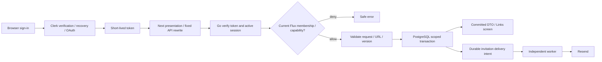

# Phase 2: Tenant-Safe Link Control Plane - Research

**Researched:** 2026-10-08
**Domain:** Go/Echo tenant control plane, PostgreSQL transactions, Clerk identity, Next.js dashboard
**Confidence:** HIGH for existing foundation and database mechanisms; MEDIUM for provider integration until real-instance acceptance.

<user_constraints>
## User Constraints (from CONTEXT.md)

### Locked Decisions

- **D-01:** Use email and password for the email authentication option, with email verification and password recovery. Include Google and GitHub sign-in as specified in `spec.md` §22. The user selected email/password rather than an emailed sign-in link.
- **D-02:** A new user creating their first workspace must explicitly enter a workspace name; create the workspace and its owner membership atomically. Do not silently create a default personal workspace. Valid invitation onboarding should lead to the invited workspace rather than force creation of an unrelated workspace; retain explicit, authorized invitation acceptance.
- **D-03:** Returning users reopen their last-used workspace only while they remain a member. If that membership is no longer valid, show their available workspaces without exposing the former workspace's data. Server-side membership checks remain authoritative, including across browser tabs and previously stored workspace selections.
- **D-04:** A newly created workspace opens its Links page. The empty state prominently offers “Create your first link”; team invitations are not a mandatory step before accessing links. Do not imply that redirects or analytics are delivered by this phase.

### the agent's Discretion

The user chose to discuss only sign-in and onboarding, then explicitly chose “Capture context” with the other areas left to research and planning. Team permission details and invitation policies, custom-key rules and collision feedback, and the link library/lifecycle interaction design are delegated within the existing roadmap requirements. Research and plan these choices, document the resulting policies, and preserve all required capabilities; lack of discussion is not permission to omit them.

- Evaluate the existing Clerk integration and choose the exact supported identity/session implementation during research. Clerk is an existing asset, not a separately confirmed user lock. Never use provider organization claims as a substitute for authoritative Flux workspace membership and permissions.
- Choose session expiry/rotation behavior, account recovery presentation, invitation entry handling and workspace-selection persistence with appropriate security and denial tests.
- Design the initial dashboard shell, workspace switcher, responsive layout, forms, loading/error states and keyboard/accessibility behavior within the original product direction in `spec.md` §§48–50.
- Choose precise member permissions, owner-preservation rules, invitation expiry and acceptance behavior; short-key normalization and reservation; lifecycle transition rules and concurrency/idempotency semantics. Make these explicit and testable before execution.
- Choose internal packages, SQL/migration layout, transaction boundaries, narrowly injected dependencies and test organization without rewriting functioning foundation code.

### Deferred Ideas (OUT OF SCOPE)

None were proposed during discussion. Redirects, analytics and the other later-phase capabilities remain outside Phase 2 as already allocated by the roadmap.
</user_constraints>

## Summary

Use the existing Go/Echo composition, pgx pool, Tern migrations, authored Zod/ts-rest contracts and deterministic generation. Current source has independent roles and real tests; product repositories and `/api/v1` remain scaffolds, and `apps/frontend` has no dashboard. The historical maps describe obsolete lifecycle, runtime and CI behavior. [VERIFIED: apps/backend/internal/app/api.go; internal/repository/repositories.go; internal/router/router.go; scripts/check.ts; .planning/PROJECT.md]

Select Clerk for managed authentication and Next.js App Router for presentation. Keep workspace authorization and business transactions in Go/PostgreSQL. Clerk supports the selected password and social strategies; its official testing helpers require a development instance and keys. Provider-free Go tests can prove cryptographic and failure boundaries, but cannot prove actual signup, recovery or OAuth. [CITED: https://clerk.com/docs/guides/configure/auth-strategies/sign-up-sign-in-options] [CITED: https://clerk.com/docs/guides/development/testing/playwright/overview]

**Primary recommendation:** Deliver successive complete browser→Go→PostgreSQL slices, starting with authenticated onboarding and one create/inspect-link journey, then extending permissions, invitations, lifecycle and abuse controls. This is a delegated design recommendation, not a newly inferred user lock. [VERIFIED: .planning/ROADMAP.md Phase 2; 02-CONTEXT.md discretion]

## Architectural Responsibility Map

The following assignments implement the documented Go-first boundary. [VERIFIED: spec.md §§48–50; 02-CONTEXT.md]

| Capability | Primary tier | Secondary tier | Rationale |
|---|---|---|---|
| Password/social identity and recovery | Clerk | Browser | Provider owns authentication factors |
| Identity mapping and authorization | Go API | PostgreSQL | Flux membership is authoritative |
| Workspace, invitation, link mutations | Go services | PostgreSQL | Transactions enforce invariants |
| Dashboard, forms, selection | Browser/Next.js | Go API | Presentation consumes authorized results |
| Invitation delivery | Worker | PostgreSQL/Resend | Durable intent precedes external effect |
| Destination/egress safety | Go | Network deployment | Shared validation and guarded transport |
| Redirect execution/invalidation | Later Phase 3 | — | Explicitly outside this phase |

<phase_requirements>
## Phase Requirements

Descriptions below are copied from REQUIREMENTS.md. [VERIFIED: .planning/REQUIREMENTS.md]

| ID | Description | Research support |
|---|---|---|
| TEN-01 | A user can sign up or sign in through the selected identity provider and Flux maps that identity to an internal user record. | Clerk adapter, unique issuer/subject, real provider proof |
| TEN-02 | An authenticated user can create a workspace and becomes its owner atomically. | Workspace/owner transaction and onboarding |
| TEN-03 | A workspace owner or admin can invite a member, and the invitee can accept a valid unexpired invitation. | Hashed invitation, verified recipient, durable delivery |
| TEN-04 | A workspace owner or admin can list members, change allowed roles, and remove members without leaving a workspace ownerless. | Role matrix and serialized owner invariant |
| TEN-05 | Workspace roles owner, admin, member, and viewer enforce documented permissions at the server-side service boundary. | Deny-by-default service capabilities |
| TEN-06 | A user can switch among workspaces they belong to without exposing data, identifiers, cache entries, jobs, or analytics from another workspace. | Fresh membership and selection checks |
| TEN-07 | Every workspace-owned database record, event, idempotency record, cache key, and analytical fact contains or unambiguously resolves to a workspace identifier. | Composite references and tenant envelopes |
| TEN-08 | Automated two-workspace denial tests prove that direct IDs, listing filters, background work, and analytics queries cannot cross tenant boundaries. | HTTP/SQL/job denial; explicit absent analytics boundary |
| LINK-01 | A workspace member with permission can create a link on the managed Flux domain using a generated collision-resistant short key and a validated HTTP(S) destination. | Crypto-generated key and URL policy |
| LINK-02 | A workspace member can request an available custom short key, while PostgreSQL uniqueness prevents normalized domain-and-key collisions under concurrency. | Global domain/key unique index |
| LINK-03 | A workspace member can view a link with its destination, title, lifecycle state, creator, timestamps, and stable public short URL. | Tenant detail DTO and canonical URL |
| LINK-05 | A workspace member can enable, disable, archive, restore, and soft-delete a link according to documented lifecycle transitions. | Explicit state machine |
| LINK-06 | A workspace member can list links with cursor pagination and filter or search by short key, title, destination, and lifecycle state. | Tenant-bound keyset cursor |
| LINK-07 | Link mutations use durable idempotency or conflict handling so retries cannot create duplicate links or silently overwrite concurrent changes. | Transactional request ledger and version precondition |
| LINK-08 | Link destination validation rejects unsafe schemes, malformed URLs, embedded credentials, and destinations disallowed by the abuse policy. | Strict URL validation and configured block policy |
| LINK-09 | Authorized workspace administrators can suspend an abusive link and record the actor, reason, and time of the action. | Admin-only suspension and audit |
| SAFE-02 | Session handling uses secure cookie and CSRF protections appropriate to the chosen authentication flow, with expiry and rotation behavior tested. | Provider cookie/refresh proof; explicit bearer and Origin controls |
| SAFE-03 | All database access uses parameterized SQL, explicit transaction boundaries, and workspace-scoped queries or constraints. | pgx transactions and mandatory scope |
| SAFE-04 | Any outbound URL processing resolves and connects with SSRF defenses against loopback, private, link-local, metadata, and disallowed redirect destinations. | Guarded dial/redirect handling; no creation-time fetch |
</phase_requirements>

## Project Constraints (from AGENTS.md)

Actionable directives retained for planning: preserve sound Go/Echo foundations and independent binaries; PostgreSQL is transactional authority; Redis is derived/transient; every tenant entity resolves to a workspace; authorization and isolation tests begin with the first schema; redirects remain independent of analytics and later latency targets; strict URL/SSRF validation, secure sessions, applicable CSRF, rate limits and parameterized SQL are mandatory. Preserve privacy, avoid raw network identifiers and fingerprinting, store money as integer minor units plus currency, maintain versioned API/errors/IDs/pagination/idempotency/OpenAPI, test major logic, validate external inputs, and prohibit placeholder production paths and swallowed errors. Use original branding. [VERIFIED: AGENTS.md]

Follow lowercase responsibility filenames, numbered Tern SQL, explicit constructors, contexts, wrapped errors and centralized error serialization; contextual structured logging must remain sanitized. Preserve wire spelling, `Z` schema prefixes, NodeNext `.js` imports, workspace exports and contract aggregation. Use Go formatting, configured specific/explained lint suppressions, strict TypeScript and actual package checks. Retain contract-generated Go boundaries. Do not treat historical unused scaffolds or root script names as implementation proof. No project-local skill directories or knowledge graph were found in the inspected paths. [VERIFIED: AGENTS.md; current packages; filesystem discovery]

## Standard Stack

Exact additions were discovered in official docs/Context7, checked against npm and passed slopcheck. Existing Go dependencies remain pinned rather than upgraded opportunistically. [VERIFIED: npm registry; slopcheck scan; apps/backend/go.mod]

| Component | Version | Evidence / purpose |
|---|---|---|
| Go / Node / Bun | 1.26.8 / 22.23.3 / 1.3.14 | Current module/runtime pins; Go launcher outside module reports 1.25.5, module selects 1.26.8 [VERIFIED: go version inside/outside apps/backend; .tool-versions] |
| Echo / pgx / Tern | 4.15.3 / 5.9.2 / 2.4.1 | Reuse existing HTTP/database/migration boundaries [VERIFIED: go.mod] |
| Clerk Go | 2.6.0, published 2026-05-08 | Existing SDK exposes injectable JWKS, clock and resource clients [VERIFIED: Go module metadata; SDK jwt/jwt.go, session/client.go] |
| Next.js | 16.4.0, published 2026-10-06 | Matches root override; Node minimum 20.9 [VERIFIED: npm registry] [CITED: https://nextjs.org/docs/app/getting-started/installation] |
| React / React DOM | Existing ^19.2.6 | Do not independently downgrade root/email graphs [VERIFIED: package.json] |
| `@clerk/nextjs` | 7.9.12, published 2026-10-07 | Next/React peer ranges admit root baselines [VERIFIED: npm registry] [CITED: https://clerk.com/docs/nextjs/getting-started/quickstart] |
| `@clerk/testing` | 2.2.44, published 2026-10-07 | Official provider test helpers [VERIFIED: npm registry] [CITED: https://clerk.com/docs/guides/development/testing/playwright/overview] |
| `@playwright/test` | 1.64.0, published 2026-10-07 | Browser proof; Node >=20 [VERIFIED: npm registry] [CITED: https://playwright.dev/docs/intro] |
| PostgreSQL / Redis | 17.11 / 8.10.2 digest-pinned | Preserve matching Compose/Testcontainers images [VERIFIED: compose.yaml; internal/testing/container.go] |

Reuse existing Zod 3 and ts-rest contracts, Bun tests, Biome and root tools. Use plain CSS design tokens/components initially to minimize new dependencies; no ORM, custom authentication framework or UI package is necessary. Exact frozen transitive compatibility, Next build under current TypeScript and browser binary installation remain execution checks, not verified runtime results. [VERIFIED: current manifests and tools.lock.json; 02-CONTEXT.md delegated package choice]

**Installation direction:** add exact Next/Clerk dependencies and exact testing devDependencies to `apps/frontend/package.json`, update only Bun's root lock intentionally, then prove clean `bun install --frozen-lockfile`. Do not use unpinned scaffolder downloads. [VERIFIED: docs/development.md; package.json]

## Package Legitimacy Audit

`slopcheck install … --json` was attempted; the installed CLI rejects that flag. Its read-only equivalent `slopcheck scan <package> --pkg npm --json` produced OK for all four packages without installing application dependencies. Registry metadata reported no postinstall scripts for these packages. Downloads cover 2026-09-28 through 2026-10-04. [VERIFIED: slopcheck CLI; npm registry/download API]

| Package | Registry age | Weekly downloads | Source repository | Verdict / disposition |
|---|---|---:|---|---|
| next | Since 2011-07-11 | 76,902,421 | vercel/next.js | OK / approved |
| @clerk/nextjs | Since 2021-08-18 | 3,143,245 | clerk/javascript | OK / approved |
| @clerk/testing | Since 2024-04-23 | 1,390,783 | clerk/javascript | OK / approved |
| @playwright/test | Since 2020-09-24 | 86,157,551 | microsoft/playwright | OK / approved |

Removed packages: none. Suspicious packages: none. Audit covers recommended direct additions; frozen installation and dependency scans must still verify the complete graph. [VERIFIED: audit results; docs/development.md]

## Architecture Patterns

### System architecture

Recommended flow implements the locked Go-backed frontend boundary. [VERIFIED: spec.md §48; 02-CONTEXT.md]



### Authentication and sessions

Use Clerk prebuilt sign-in/sign-up/recovery components, configured for verified email/password, Google and GitHub. Go maps `(configured issuer, subject)` to a unique internal UUID; never merge identities by email or trust organization claims. Fetch verified provider profile data when first mapping and at invitation acceptance; unverified/self-submitted email cannot authorize membership. [CITED: https://clerk.com/docs/go/getting-started/quickstart] [VERIFIED: SDK user/session clients; 02-CONTEXT.md]

Use `getToken()` and explicit bearer headers through a fixed same-origin `/api/v1` rewrite; the Go product API must ignore ambient Clerk cookies. Keep tokens out of localStorage, URLs, logs and arbitrary Next caches. Authenticate in Go even when frontend middleware protects screens. Use injected `jwt.Verify` with exact configured issuer checked after SDK verification, exact nonempty authorized-party allowlist, valid subject/session, expiry/not-before and supported active session state. SDK issuer validation alone is not an exact application-instance allowlist. [VERIFIED: Clerk SDK v2.6.0 jwt/jwt.go] [CITED: https://clerk.com/docs/guides/sessions/session-tokens] [CITED: https://github.com/clerk/clerk-docs/blob/main/clerk-typedoc/react/use-auth.mdx]

Recommended revocation policy: check provider session-active state on every authenticated control-plane request, with a bounded timeout and safe 503 on provider failure; reject revoked sessions even while their JWT remains cryptographically valid. This trades control-plane availability/latency and provider quota for immediate observed revocation without a new session subsystem. No such dependency belongs in the redirector. Inject `session.Client` and user client rather than `clerk.SetKey` globals. Require a provider-load/quota check before production. [VERIFIED: SDK session/client.go; current role separation; delegated session policy]

Retain provider default seven-day maximum lifetime; let the SDK refresh short-lived tokens and require fresh login after expiry. Do not assume a custom inactivity timeout is free: Clerk documents production plan requirements for customized lifetimes. Test token expiry, refresh, signout, recovery-triggered session behavior and key rotation. Clerk's long-lived FAPI credential is HttpOnly; the short-lived application JWT is a separate credential. Inspect actual production Secure/SameSite attributes rather than claiming every Clerk cookie is HttpOnly. [CITED: https://clerk.com/docs/guides/secure/session-options] [CITED: https://clerk.com/docs/guides/development/sdk-development/terminology]

Require exact allowed Origin on browser mutations; reject missing/null/foreign origins for this browser-only slice. JSON content type and explicit Authorization are mandatory; disable wildcard credentialed CORS. Test cross-site forms, preflights and cookie-only calls. If any Go/BFF mutation later accepts ambient cookies, add synchronizer-token CSRF protection before enabling that path. Recovery responses should avoid exposing account existence; success and error UI must remain safe. [CITED: https://cheatsheetseries.owasp.org/cheatsheets/Cross-Site_Request_Forgery_Prevention_Cheat_Sheet.html] [VERIFIED: delegated session policy; SAFE-02]

### Persistence, transactions and tenant isolation

Recommended schema: `users`, `workspaces`, `workspace_memberships`, `workspace_invitations`, `links`, `mutation_requests`, `audit_events`, and invitation delivery intents. Global users carry identity namespace; every other owned row carries `workspace_id`. Use `(workspace_id,id)` unique keys and composite foreign keys for dependent records; membership uniqueness is `(workspace_id,user_id)`. Store roles/states with constrained values. Use one configured managed hostname, normalized once at startup. Domain/key uniqueness must be global across workspaces sharing that host. [CITED: https://www.postgresql.org/docs/17/ddl-constraints.html] [VERIFIED: TEN-07; delegated schema policy]

All repository reads/writes accept a required scope; SQL includes `workspace_id=$1` and parameters. Foreign IDs yield safe 404 without revealing existence. Service authorization remains mandatory for internal callers. For mutations, lock the workspace before membership/resource locks and recheck authorization inside the transaction. Use a shared workspace lock for ordinary link writes and an exclusive lock for membership/owner/invitation changes; lock actor membership against concurrent removal/role change. Document one lock order. PostgreSQL row locks serialize competing changes; READ COMMITTED snapshots alone do not protect a multi-row owner count. [CITED: https://www.postgresql.org/docs/17/explicit-locking.html] [CITED: https://www.postgresql.org/docs/17/transaction-iso.html]

Use `pgx.BeginFunc`/`BeginTxFunc`, passing context to every statement. Bootstrap workspace and owner in one transaction; rollback leaves neither. Treat RLS as optional defense-in-depth rather than the authorization implementation: owners/superusers can bypass it, and pooled connection state requires careful scoping. Explicit tenant queries, composite constraints and adversarial tests are the baseline. [CITED: https://github.com/jackc/pgx/blob/master/_autodocs/api-reference/tx.md] [CITED: https://www.postgresql.org/docs/17/ddl-rowsecurity.html]

### Team and invitation policies

The following concrete choices are recommendations in explicitly delegated areas. [VERIFIED: 02-CONTEXT.md discretion]

| Capability | Owner | Admin | Member | Viewer |
|---|---|---|---|---|
| Read links / select workspace | Yes | Yes | Yes | Yes |
| Create / ordinary lifecycle | Yes | Yes | Yes | No |
| List/manage team / invite | Yes | Yes | No | No |
| Manage admin/owner roles | Yes | No | No | No |
| Suspend / clear suspension with reason | Yes | Yes | No | No |

Admins may invite/change/remove member/viewer accounts only; owners may manage all roles but cannot demote/remove the final owner. Promotion before demotion provides safe ownership transfer. Serialize changes on the workspace row, re-read actor/target and count owners while locked. Test two owners concurrently leaving/demoting and an admin attempting escalation.

Invitations expire after seven days, grant admin/member/viewer only, and store a SHA-256 digest of a 256-bit cryptographically random one-use token. Owners can invite admins; admins cannot. Normalize email by trim/casefold without provider-specific dot/plus alias rewriting. One pending invitation per workspace/email; resend revokes/replaces old token. Acceptance locks workspace and invitation, checks expiry/revocation and the currently verified recipient, inserts membership atomically, then marks accepted. Repeated acceptance by the same recipient is successful without changing an existing role. A different recipient receives a safe denial. Explicit acceptance survives sign-in through a sanitized internal continuation; no token appears in observability or referrers.

Commit delivery intent with invitation state. Store the delivery token encrypted in PostgreSQL using standard-library AES-256-GCM with `cipher.NewGCMWithRandomNonce`, an externally supplied key and workspace/invitation IDs as associated data; persist only its acceptance digest outside that envelope. Worker receives workspace/invitation identity, re-reads scoped state, decrypts only for delivery, ignores revoked/accepted/expired intents, and retries bounded failures. Delete encrypted delivery material after successful delivery; resend issues a new token. Document key rotation and the standard API's per-key message limit. API owns no consumer; independent worker dispatches pending intents and uses Redis/Asynq only as recoverable coordination. Never declare sent before actual delivery, or include tokens/email in telemetry. [VERIFIED: Go1.26.8 go doc crypto/cipher.NewGCMWithRandomNonce; delegated delivery policy]

### Links, keys and lifecycle policies

These are delegated product policies, with PostgreSQL mechanics verified above. [VERIFIED: 02-CONTEXT.md discretion; LINK requirements]

Use lowercase ASCII keys, 3–64 characters matching `[a-z0-9][a-z0-9_-]{2,63}`; reject slash, percent escapes, whitespace and ambiguous Unicode. Reserve system paths including `api`, `docs`, `live`, `ready`, `static`, `login`, `register`, `dashboard`, `settings`, `links`, `admin`. Generated keys use 12 random bytes encoded lowercase unpadded base32, with bounded retries on only the domain/key unique violation. Custom collisions return 409 `KEY_UNAVAILABLE`; availability queries are advisory and expose no owner. Keep uniqueness across soft-deleted rows so a stable public URL is never silently reassigned.

Create accepts destination, optional title (maximum 200 characters), optional custom key; domain is server-selected. Detail exposes UUID, canonical short URL, destination, title, creator, timestamps, version, lifecycle and suspension status. Default state is active. Permit active→disabled, disabled→active, either→archived, archived→disabled on restore, and any nondeleted lifecycle→deleted. Soft-delete restore returns disabled. No hard deletion or destination/title editing in Phase 2. Store suspension separately with actor/reason/time and immutable audit event: ordinary restore/enable never clears it. Owner/admin clearing suspension requires a reason and leaves routing disabled until explicitly enabled. UI must expose the resulting effective state.

Use `version bigint`, returned as an SDK-safe decimal string if generated types cannot guarantee integer precision. Mutations require expected version; UPDATE includes workspace/id/version and increments once. Missing precondition returns 428; stale precondition returns 409 `VERSION_CONFLICT` (or consistently documented 412 if using HTTP If-Match). Mandatory create idempotency keys are scoped by workspace, actor and operation. Hash canonical validated payload; same key/same hash returns original committed outcome, different hash returns 409. Commit ledger and business effect together; authorize before replaying stored responses. Keep replay records at least 24 hours with a documented retention window. Workspace creation uses an identity-scoped bootstrap key and records the resulting workspace in the same transaction.

List defaults to nondeleted rows; page size 25, maximum 100; order `(created_at DESC,id DESC)` and seek on both fields. Opaque bounded cursors bind workspace and filter/search fingerprint, validate types and reject reuse across tenants. Search matches key/title/destination with parameterized escaped LIKE/ILIKE and bounded query length; lifecycle filter uses closed enums. Do not promise full-text relevance or unmeasured index performance. On switch/signout, cancel outstanding requests and clear cached tenant data; server preference stores last-used workspace only after authorization, and bootstrap returns a chooser if no longer authorized.

### Destination and egress safety

Reject non-HTTP(S), relative/opaque/malformed URLs, empty hosts, userinfo, control characters, backslashes, invalid ports and blocked hosts/IP literals. Normalize hostname using existing `golang.org/x/net/idna`; preserve destination path/query meaning. Recommended initial abuse policy disallows private/local/metadata destinations, the managed short host (redirect loops), and configured blocked hosts, with safe field errors. No network fetch or preview scraping belongs on link creation. [VERIFIED: LINK-08; spec.md §54; existing golang.org/x/net dependency]

For any outbound processing introduced, validate all DNS answers, unmap IPv4-mapped IPv6, reject loopback/private/link-local/unspecified/multicast/reserved/metadata addresses, and dial the already-validated address while preserving TLS server name. Disable environment proxy inheritance; revalidate every redirect or reject redirects entirely; bound timeout, hops and response bytes. `IsGlobalUnicast` alone admits private addresses. Trusted Clerk/Resend transport uses fixed HTTPS service endpoints rather than user-controlled bases; test-only overrides stay dependency-injected. [CITED: https://cheatsheetseries.owasp.org/cheatsheets/Server_Side_Request_Forgery_Prevention_Cheat_Sheet.html] [CITED: https://pkg.go.dev/net/netip#Addr.IsGlobalUnicast] [CITED: https://pkg.go.dev/net/http#Transport]

## File, Endpoint and Contract Direction

Extend existing layers, not a replacement tree. The following locations/routes are recommended scope assignments. [VERIFIED: current source; 02-CONTEXT.md]

| Location | Responsibility |
|---|---|
| `internal/service/{identity,workspace,team,link}.go` | Narrow injected auth and domain services |
| `internal/repository/{user,workspace,invitation,link,mutation}.go` | Scoped SQL and transaction operations |
| `internal/database/migrations/002_*.sql` onward | Product schema and constraints |
| `internal/handler/` / `router/` | Product HTTP binding, authorization, safe errors |
| `internal/safety/` | URL policy and guarded outbound processing |
| `packages/zod/src/` / `packages/openapi/src/contracts/` | Authoritative DTOs, request/header/error contracts |
| `internal/transport/` / `scripts/generate.ts` | Expand generation beyond health-only assumptions |
| `apps/frontend/app/`, `components/`, `lib/` | Auth, onboarding, Links, details, team, switcher |

Use `/api/v1/me`, `/workspaces` GET/POST, `/me/last-workspace` PUT; workspace-scoped `/members`, `/invitations`, `/links`, `/links/{id}`, `/links/{id}/transitions`, `/links/{id}/suspension`; accept via `/invitations/accept` POST with a secret body. Define key availability without leaking another tenant. All responses include documented errors and request correlation. Document bearer security only on authenticated routes; legacy declared service-token security is not permission to implement an unverified bypass. Private API responses use `Cache-Control: no-store`. [VERIFIED: current OpenAPI security definitions; phase contract]

## Don't Hand-Roll / Common Pitfalls

| Problem | Use instead | Pitfall to verify |
|---|---|---|
| Passwords/OAuth/JWT cryptography | Clerk components and verified SDK | Fake login, email-based identity merging, stale org claims |
| Concurrency/uniqueness | PostgreSQL locks, unique/FK constraints | Precheck-then-insert and unlocked owner counts |
| Contract transport | Existing canonical generation | Handwritten competing DTOs or health-only generator tests |
| Randomness/hashing | Go crypto standard library | Predictable keys or plaintext invitation credentials |
| SQL/query parsing | pgx parameters and closed options | Dynamic SQL fields and unsigned tenant trust |
| Real browser behavior | Playwright | Mock API snapshots passed off as authenticated journey proof |

The selected provider/stack and mechanisms are supported by the sources above; pitfall prevention is a recommended validation strategy. No new analytics implementation, Redis link cache, redirect invalidation, LINK-04 editing or custom-domain setup belongs here. TEN-08 must prove absence/rejection of future analytical paths and tenant-shaped interfaces without claiming executable analytics coverage. [VERIFIED: Phase 2 allocation; current foundation]

## Suggested Vertical Slice Sequence

1. Provider adapter, internal identity, explicit workspace creation, chooser and empty Links page; include contracts, schema, HTTP and browser proof.
2. Safe managed-domain create/detail/list/search with key uniqueness, idempotency and two-workspace denials; the first usable link-management slice.
3. Workspace switching, team role matrix, owner preservation, invitations and durable worker delivery; include race/denial/browser proof.
4. Lifecycle/version conflicts, deleted-link restore, administrator suspension/audit and accessible responsive interactions.
5. Full dependency/provider acceptance, generation, migration-forward checks, browser denial across tabs and root gates.

Each slice includes persistence→service→HTTP→contract→UI→tests; do not defer all UI or all isolation tests to a final horizontal plan. These are sequencing recommendations under MVP mode, with walking-skeleton mode false because Phase 1 exists. [VERIFIED: ROADMAP.md mode/dependency; 01-VERIFICATION.md; parent planning scope]

## Validation Architecture

Included explicitly for this research despite `workflow.nyquist_validation:false`, as requested by the planning orchestrator. Current gates compare compiled Go discovery, execute race-enabled tests and require nonzero Bun tests. Classify every new container-backed Go test in `scripts/check.ts`; the frontend needs real format/lint/typecheck/test/build scripts. [VERIFIED: .planning/config.json; scripts/check.ts; orchestrator instruction]

| Layer | Command / scope | Required evidence |
|---|---|---|
| Quick Go unit | `cd apps/backend && go test -race ./internal/service ./internal/safety ./internal/middleware` | Role/state tables, validation, signed JWT expiry/issuer/azp/key rotation, provider failure |
| Real database/HTTP | `bun run test:integration` | Migrated pinned PostgreSQL, concurrent requests, rows/audits/ledger atomicity |
| Contract/UI units | `bun run test:unit` | Authored/Go DTO agreement, selection/loading/error/cursor behavior |
| Browser | Frontend `test:e2e` using pinned Playwright | Actual rendered frontend and Go server with real PostgreSQL; provider-authenticated journey |
| Full phase | `CI=true bun run check` and `CI=true bun run scan` | Frozen builds/generation/migrations/race/nozero/dependency/worktree/history scans |

Commands naming new packages/files become runnable after their first slice; do not claim an existing passing suite. Container/browser stages have realistic startup deadlines rather than a fictitious sub-30-second guarantee. [VERIFIED: existing test runner; current absent product packages]

| Requirements | Test map / new files |
|---|---|
| TEN-01, SAFE-02 | `identity_test.go`, auth HTTP tests, provider Playwright signup/password/verification/recovery/Google/GitHub and token refresh/logout |
| TEN-02, TEN-06 | Workspace transaction tests and browser name→Links→switch→removed-membership chooser |
| TEN-03, TEN-04, TEN-05 | Concurrent owner changes; forged roles; expired/revoked/wrong-recipient/repeated invitations; real Redis worker tenant checks |
| TEN-07, TEN-08, SAFE-03 | Direct IDs, foreign filters/cursors, composite FK violations, ledger replay after revocation, forged worker workspace, no foreign identifiers in responses |
| LINK-01, LINK-02, LINK-07 | Same-key concurrent creates, RNG collisions, same/different-hash retries, rollback and one-winner version races |
| LINK-03, LINK-06 | Stable URL/detail projection, equal-timestamp pagination, search escaping, filters, deleted visibility and foreign cursor denial |
| LINK-05, LINK-09 | Every allowed/denied lifecycle edge, suspension cannot be bypassed, audit actor/reason/time atomicity |
| LINK-08, SAFE-04 | URL adversarial corpus; mapped IPv6/private DNS/rebinding/redirect/proxy/timeout tests; creation makes no destination request |

Wave 0 belongs inside the first slice: product fixtures, safe signed-token/JWKS provider transport seam, frontend package/tests, pinned browser provisioning and root classification. Never ship a production test-login route or accept test keys through runtime mode switches. Provider helpers can bypass authentication factors when signing in tests, so separate those setup helpers from tests proving verification/recovery itself. [CITED: https://github.com/clerk/clerk-docs/blob/main/docs/guides/development/testing/playwright/test-helpers.mdx]

## Security Domain

Use versioned ASVS 5.0.0 references; the older template's V2-auth/V3-session/V4-access-control labels do not match current numbering. Relevant current chapters are V1 encoding/sanitization, V2 validation/business logic, V3 frontend security, V4 API/web services, V6 authentication, V7 session management, V8 authorization, V11 cryptography and V16 logging/error handling. This is applicability mapping, not a certification claim. [CITED: https://owasp.org/projects/asvs] [CITED: https://raw.githubusercontent.com/OWASP/ASVS/v5.0.0/5.0/docs_en/OWASP_Application_Security_Verification_Standard_5.0.0_en.json]

Threat coverage: spoofing→verified issuer/subject/session; elevation→Flux capabilities and owner locks; tampering→tenant FKs/version/hash; disclosure→scoped queries/no-store/safe errors; CSRF/XSS→explicit bearer/Origin/escaped UI; SSRF→validated dial and fixed service endpoints; repudiation→transactional audit; denial of service→bounded inputs/timeouts/rate limits. Preserve the existing observability closed allowlist; audit identities belong in protected database records, not new log labels. [VERIFIED: AGENTS.md; internal/observability/; recommended phase threat mapping]

## Code Examples

Verified SDK/pgx APIs; application authorization remains deliberately explicit. [VERIFIED: installed Clerk SDK jwt/jwt.go] [CITED: https://github.com/jackc/pgx/blob/master/_autodocs/api-reference/tx.md]

```go
claims, err := jwt.Verify(ctx, &jwt.VerifyParams{
    Token: token, JWKSClient: injectedJWKS, Clock: injectedClock,
    AuthorizedPartyHandler: func(azp string) bool { return azp == allowedOrigin },
})
// After err handling: check exact configured issuer, subject, session,
// active provider session and current Flux membership. Never read org role.

err = pgx.BeginFunc(ctx, pool, func(tx pgx.Tx) error {
    // Lock and authorize inside this transaction before returning/replaying data.
    return tx.QueryRow(ctx,
        `SELECT version FROM links WHERE workspace_id=$1 AND id=$2 FOR UPDATE`,
        scope.WorkspaceID, linkID).Scan(&version)
})
```

## State of the Art / Runtime State Inventory

Phase 2 is product greenfield on a brownfield foundation, not a rename/data migration. No codename replacement or external state migration is planned. Preserve existing Clerk configuration name and narrow globals rather than rewrite every registry. Token v1 was deprecated in April 2025; retain v2-capable SDK verification, and Next 16 uses `proxy.ts` for framework middleware conventions. These are implementation-version concerns, not reasons to update foundation pins. [VERIFIED: phase boundary; current config] [CITED: https://clerk.com/docs/guides/sessions/session-tokens] [CITED: https://clerk.com/docs/nextjs/getting-started/quickstart]

## Environment Availability and Open Questions

| Dependency | Available | Evidence / next action |
|---|---|---|
| Module Go1.26.8, Node22.23.3, Bun1.3.14 | Yes | Direct probes; select module toolchain/root manifest |
| Docker29.1.3 / pinned service helpers | Yes | Docker responds; image runtime readiness still tested per suite |
| Quality tools in `tmp/tools` | Present | Verify existing manifest hashes through standard command |
| Clerk development instance/keys | Not verified | Privately provision/configure; never inspect or print `.env` values |
| Google/GitHub production credentials | Not verified | External operator configuration; required for production acceptance |
| Playwright package/browser binaries | Addition required | Exact packages audited; browser installation remains execution task |
| Invitation sender/provider delivery | Not verified | Configure legitimate sender and bounded delivery/retry proof |

Clerk development browser tests require a real instance and private keys; Google/GitHub production setup requires provider credentials. Google publishing/verification is a separate production dependency. The implementation plan should finish independent work, then use a concrete provider-configuration checkpoint if credentials remain unavailable; record acceptance as pending rather than silently skipping required provider flows. Untrusted CI must not receive these secrets. [CITED: https://clerk.com/docs/guides/development/testing/playwright/overview] [CITED: https://clerk.com/docs/guides/configure/auth-strategies/social-connections/google] [CITED: https://clerk.com/docs/guides/configure/auth-strategies/social-connections/github] [VERIFIED: docs/development.md]

Remaining execution checks: provision invitation encryption key and validate delivery recovery/key rotation; verify Clerk quota/latency for per-request session lookup; inspect production cookie behavior; prove Next/TS/frozen package compatibility and browser installation. None blocks independent planning. No exact unverified package version has been invented. [VERIFIED: research audit and boundaries]

## Assumptions Log

| # | Claim | Risk / handling |
|---|---|---|
| A1 | Existing account's private provider configuration is suitable for locked flows. [ASSUMED] | Not inspected; require real configuration and provider acceptance evidence |
| A2 | Per-request provider session lookup meets expected control-plane capacity. [ASSUMED] | Measure quota/latency before production; preserve fail-closed policy |

All concrete policies above are recommendations under explicit delegated discretion, not empirical facts or extra user locks. Version existence/peer metadata is verified; successful installation/build is explicitly pending.

## Sources and Metadata

**HIGH:** Current repository files named inline; Context7 `/clerk/clerk-docs`, `/vercel/next.js`, `/jackc/pgx`; official Clerk/Next/PostgreSQL/Go/OWASP/Playwright pages linked inline; registry metadata and read-only slopcheck results. Clerk pages inspected identify 2026-10-07 updates; Next installation and PostgreSQL17 docs were current at access. **MEDIUM:** Architecture/product policy recommendations until implementation proofs; externally configured auth and invitation delivery. **LOW:** Only assumptions A1–A2. [VERIFIED: documentation/tool results]

Canonical context reviewed: AGENTS, PROJECT, REQUIREMENTS, ROADMAP Phase2, STATE, 02-CONTEXT; spec §§5–6/21–22/48–50/54; Phase1 CONTEXT/VERIFICATION/CI-SCAN-REPAIR; development runbook and historical STACK/ARCHITECTURE/INTEGRATIONS cross-checked against source. Security and validation included. Research reviewed for omitted scope: all 19 requirements and D01–D04 map to explicit delivery/test boundaries. [VERIFIED: research reads and requirement table]

**Confidence:** stack HIGH (exact official identities/registry checks); database architecture HIGH (official mechanisms/current code); provider integration MEDIUM (real private configuration pending); pitfalls HIGH for database/token boundaries, MEDIUM for externally configured flows. **Valid until:** 2026-10-15 for package/provider details; verify before installation. No application tests were run as part of this documentation-only research.
