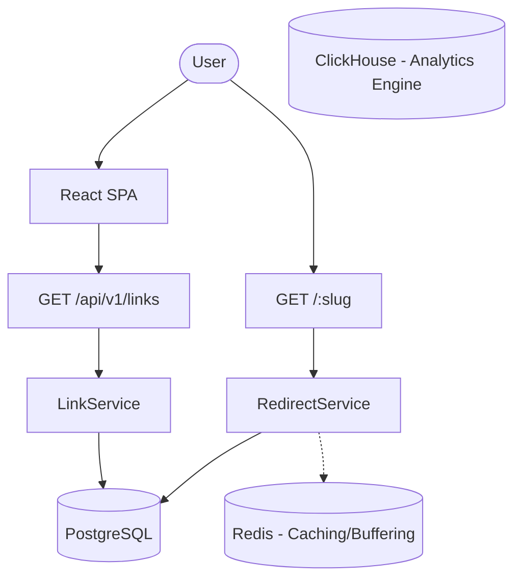

# System Architecture

## Core Stack
- **API**: Echo v4 (Go)
- **DB**: Postgres (Transactional), Redis (Cache/RateLimit), ClickHouse (Analytics)
- **Frontend**: React SPA (Vite, TS)
- **Modules**: Decoupled domain-driven design

## Current Architecture Flow

### Components

**Frontend (`apps/frontend`)**
- Built with React, Vite, Tailwind.
- High-fidelity UI using extensive mock data for advanced features.
- Uses `@ts-rest/core` to call endpoints.

**Backend (`apps/backend`)**
- Echo v4 server.
- Uses `pgxpool` for Postgres.
- `server.go` wires dependencies but passes `nil` to critical services (Redis cache, Analytics provider).
- `internal/modules` contains complex Go code (Stripe, Webhooks, Domains, AI) that is completely disconnected from the router and the database.

**Databases**
- **Postgres**: Contains `users`, `workspaces`, `links`, `link_categories`, `campaigns`, `custom_domains`, and `subscriptions`.
- **Redis**: Setup and wired for Redirect caching (`LinkRedirectTarget`) and Analytics buffering.
- **ClickHouse**: Connected and actively consuming `analytics_events` and `conversions` via queue buffering.

## Click-Time Attribution

At the instant of a link click, attribution data is resolved and snapped to the `AnalyticsEvent`. 
The `LinkRedirectTarget` holds the cached resolution of UTM parameters to ensure parity between Cache Hits and Cache Misses.

**UTM Precedence Rule:**
When resolving UTMs for analytics tracking, link-specific UTM values natively override campaign-default UTM values.
`Resolved UTM = Link override (if present) OR Campaign default (if present) OR NULL`.

## Billing Architecture
Stripe webhooks securely update Postgres (`subscriptions`). Tenant limits (e.g., max links, retention days) are loaded by `BillingRepository` on-demand and validated centrally across the backend to enforce quotas before Postgres persistence. The frontend solely relies on this backend-authoritative DB state.

## Configuration Architecture
Robust strongly-typed configuration structure powered by `koanf` and `validator`. All configuration uses `FLUX_` prefix for OS variables (e.g. `FLUX_DATABASE.PORT`). Strictly enforces security properties in production (Fail-Closed mechanisms) protecting Stripe keys, Clerk keys, and webhook secrets.
