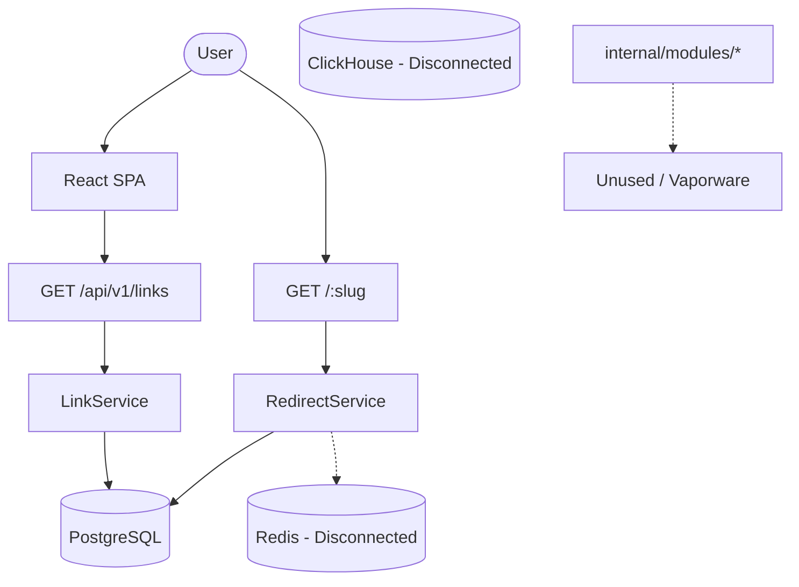

# Architecture (Reality vs Claim)

## Claimed Architecture
- **API**: Echo v4
- **DB**: Postgres (Transactional), Redis (Cache/RateLimit), ClickHouse (Analytics)
- **Frontend**: React SPA
- **Modules**: Decoupled domain-driven design

## Actual Architecture

### Components

**Frontend (`apps/frontend`)**
- Built with React, Vite, Tailwind.
- High-fidelity UI using extensive mock data for advanced features.
- Uses `@ts-rest/core` to call endpoints.

**Backend (`apps/backend`)**
- Echo v4 server.
- Uses `pgxpool` for Postgres.
- `server.go` wires dependencies but passes `nil` to critical services (Redis cache, Analytics provider).
- `internal/modules` contains complex Go code (Stripe, Webhooks, Domains, AI) that is completely disconnected from the router and the database.

**Databases**
- **Postgres**: Only has 3 tables (`links`, `link_categories`, `link_attachments`).
- **Redis**: Setup in docker-compose, but not wired in `server.go`.
- **ClickHouse**: Schema exists, but no Go code writes to it.

## Click-Time Attribution

At the instant of a link click, attribution data is resolved and snapped to the `AnalyticsEvent`. 
The `LinkRedirectTarget` holds the cached resolution of UTM parameters to ensure parity between Cache Hits and Cache Misses.

**UTM Precedence Rule:**
When resolving UTMs for analytics tracking, link-specific UTM values natively override campaign-default UTM values.
`Resolved UTM = Link override (if present) OR Campaign default (if present) OR NULL`.
